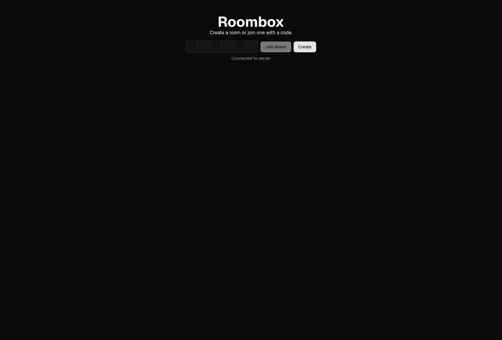
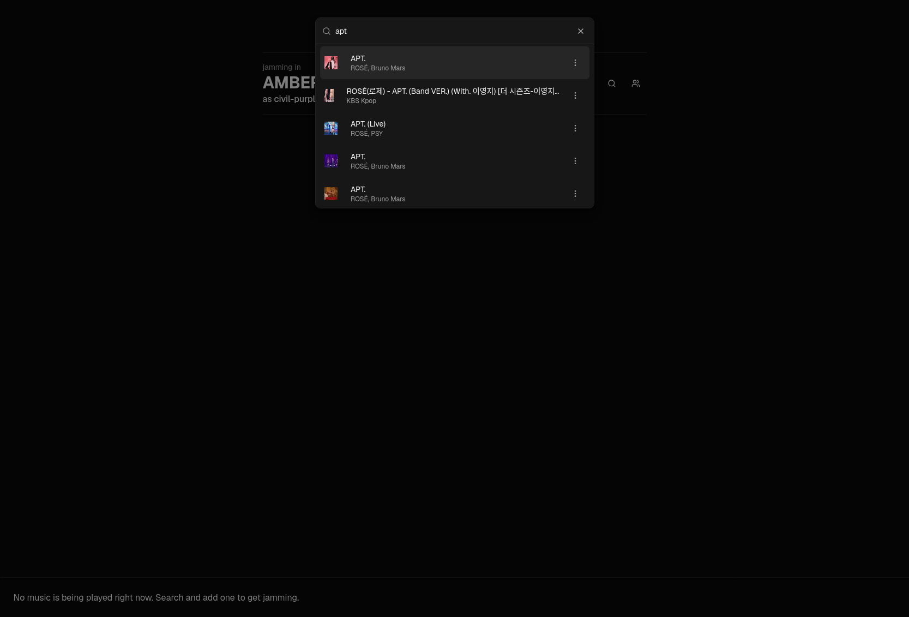
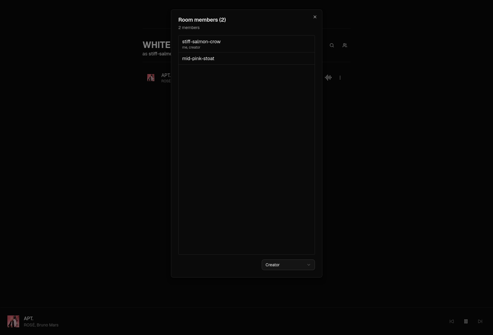
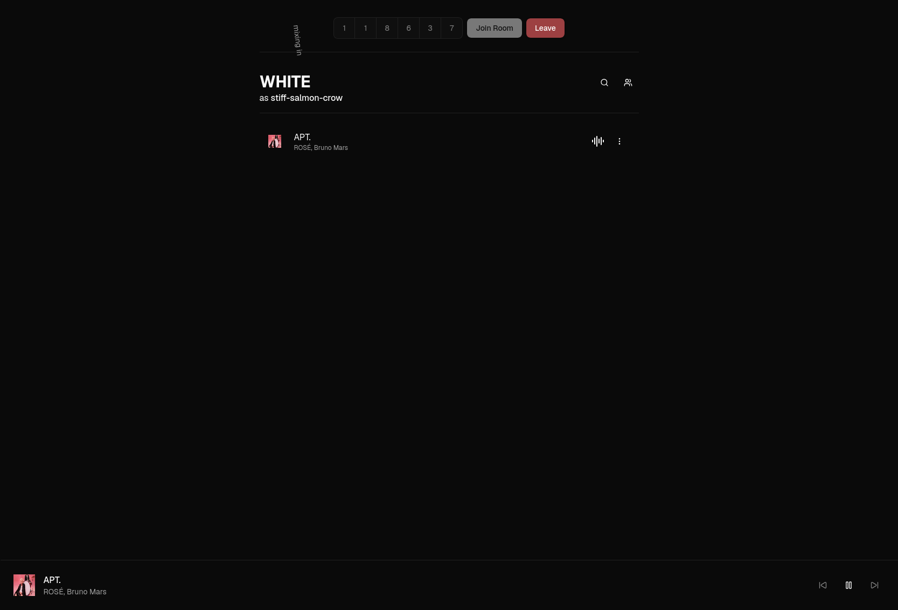
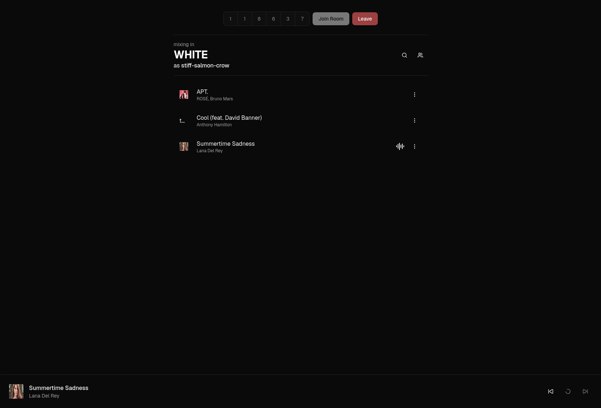

# Roombox

## Basic Details

### Team Name: Blitzkrieg

### Team Members

- Member 1: Sheron Rajesh - TKM College of Engineering
- Member 2: Swarag Siby - TKM College of Engineering

### Project Description

Locally hosted music room, where people on the same network can join in and add their favourite songs!

### The Problem (that doesn't exist)

Dictatorship over who gets to play what song.

### The Solution (that nobody asked for)

Fear not! Roombox saves you. You can just add your favourite song and the entire room is now forced to listen to your music taste!

## Technical Details

### Technologies/Components Used

For Software:

- Svelte, TypeScript, Python
- SvelteKit
- ytmusicapi, Express, sockets.io
- yt-dlp

### Implementation

For Software:

# Installation

The application consists of different components:

roombox-backend: Serves the backend socket server and room management for the appliction

```bash
cd roombox-backend
pnpm install # pnpm is preferred
```

roombox-yt: Uses unofficial YouTube API wrapper and yt-dlp in Python to retrieve search results and to download files.

```bash
cd roombox-yt
python3 -m venv .venv
source .venv/bin/activate # for bash and zsh. check otherwise if you use it so.
pip install -r requirements.txt
```

roombox-frontend: The frontend for the application.

```bash
cd roombox-frontend
pnpm install
```

# Run

```bash
cd roombox-backend
pnpm run dev
```

Take the IP and PORT and change it in the frontend

```bash
cd roombox-yt
python3 app.py
```

Take the IP and PORT and change it in the frontend

```bash
cd roombox-frontend
pnpm run dev --host
```

### Project Documentation

For Software:

# Screenshots (Add at least 3)



Simple landing page where you can create a room or enter a join code to join an existing room.


Search menu integrated with an unofficial YouTube music API.



Shows the connected members. The creator can change who can manage the list.

# Diagrams

# Build Photos





This is what the final build looks like while playing music and multiple songs in the queue.

### Project Demo

# Video

[Demo YouTube Video](https://youtu.be/68HeQf2GBfA)

The video shows how the application works. Members can join in using the join code shown at the top.

## Team Contributions

- Sheron Rajesh: Front-end and WebSocket connections
- Swarag Siby: Server-side implementation

---

Made with ❤️ at TinkerHub Useless Projects


